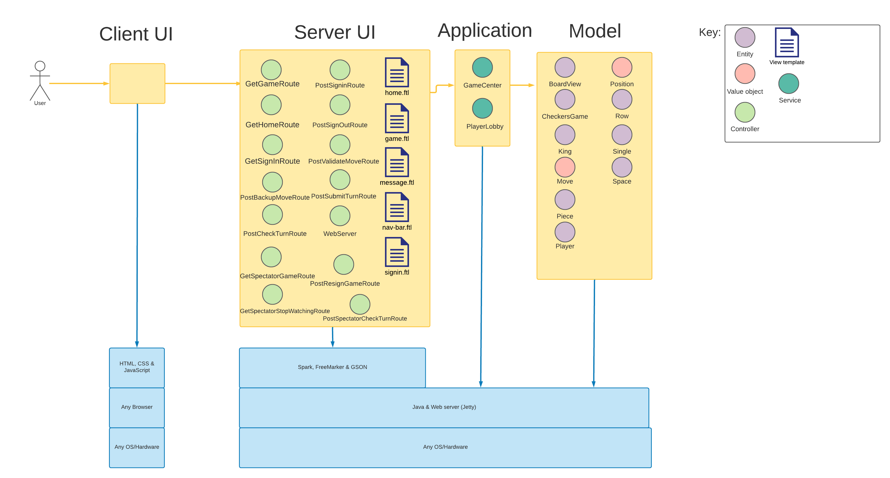
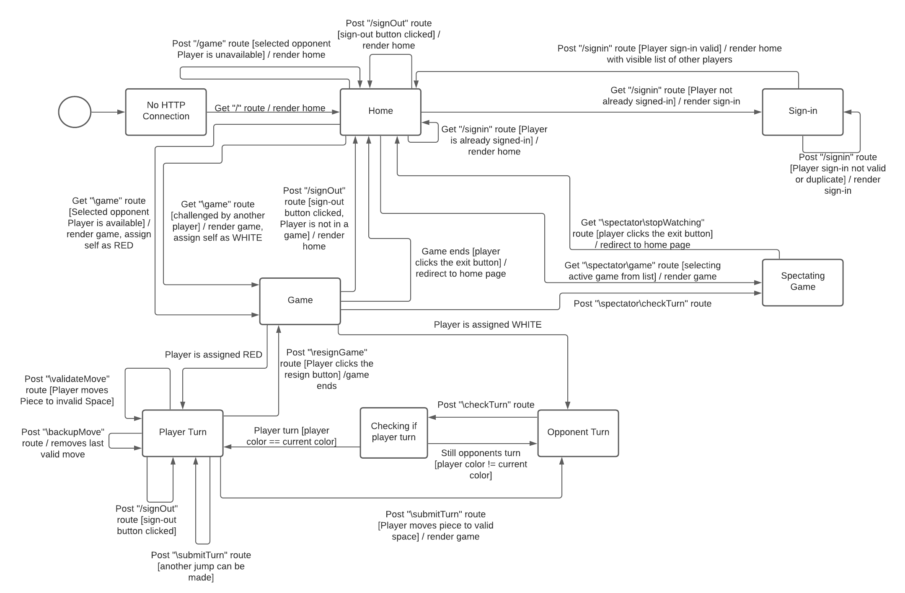
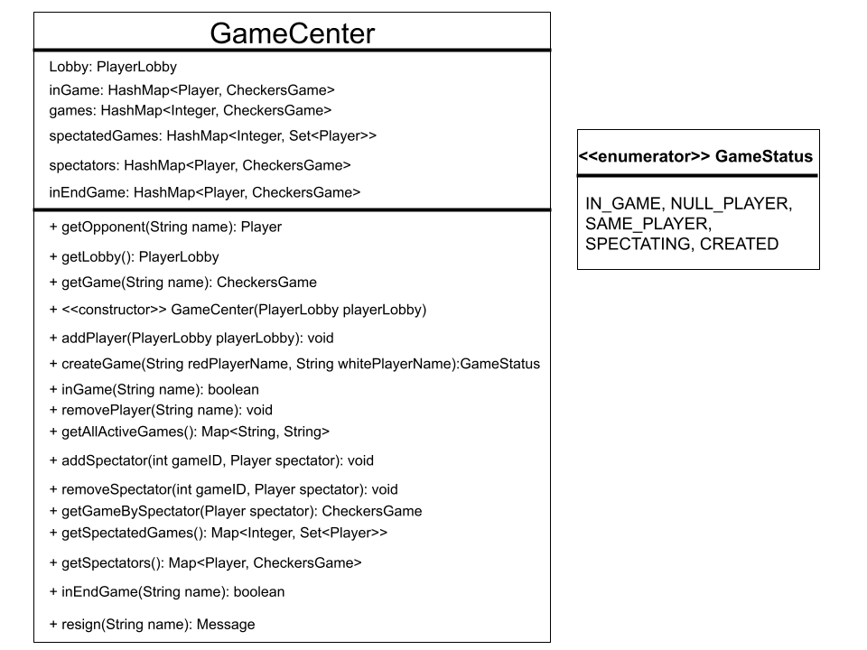
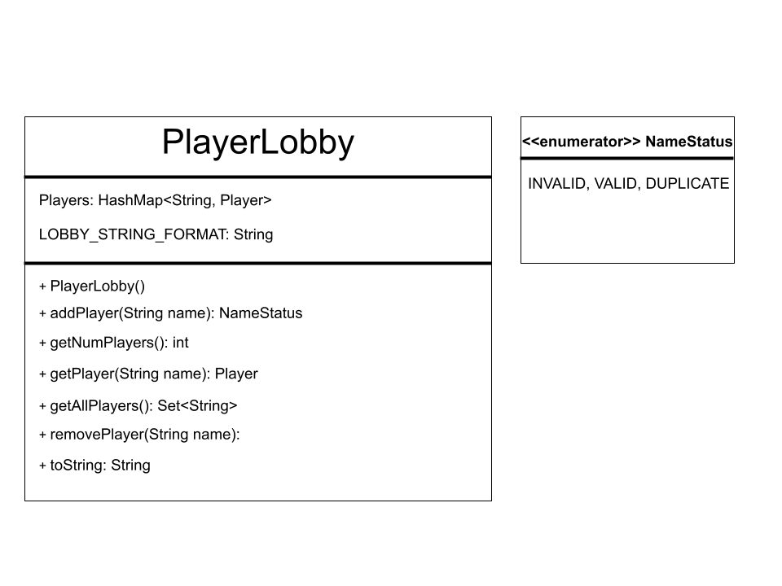
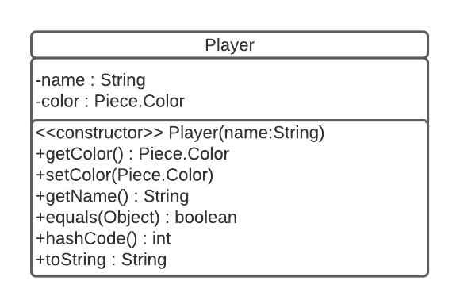
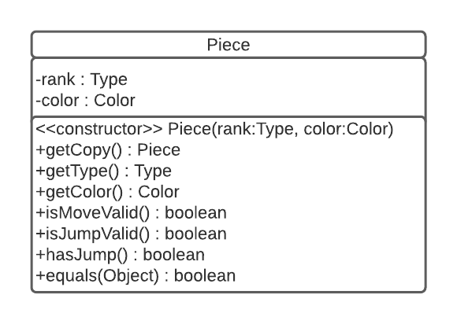
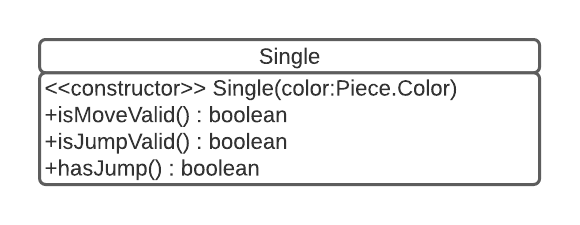

# PROJECT Design Documentation

## Team Information
* Team name: 2208-SWEN-261-01-2-Fanta
* Team members
    * Dominic Kavanagh - dsk1354@rit.edu
    * Jesse Burdick-Pless - jb4411@rit.edu
    * Jess Zhao - jlz6146@rit.edu
    * Eric Landers - esl7511@rit.edu

## Executive Summary

WebCheckers is a web-app that simulates checkers played with American rules.

The goal for the project is to allow players to sign in and challenge other players to a game of checkers.
In addition, we have added a spectator mode to further enhance the player
experience.

The application uses Spark and Freemarker for webpage rendering.

### Purpose
The WebCheckers application allows users to play checkers anytime, anywhere. It provides a simple way for players to challenge each other to a classic game of checkers from the convenience of their web browser.

### Glossary and Acronyms

| Term | Definition |
|------|------------|
| VO | Value Object |

## Requirements

This section describes the features of the application.

### Definition of MVP
>  1. Every player must sign-in before playing a game, and be able to sign-out when finished playing.
       
> 2. Two players must be able to play a game of checkers based upon the American rules.
      
> 3. Either player of a game may choose to resign, at any point, which ends the game.

### MVP Features
###Epics
>1. Epic: Moving a Checker Stories

###User Stories
> 1. Sign-Out
> 2. Moving a Normal Checker
> 3. Jump Move
> 4. Capture Checker
> 5. Choice of Jump Move
> 6. Multiple Jump Move
> 7. Kinging a Normal Checker
> 8. Moving a King Checker
> 9. Ending a Game
> 10. Resignation
> 14. Player Sign-in
> 15. Start a Game

### Roadmap of Enhancements
> 1. Spectate an Ongoing Game
> 2. Have the option for a player not in a game to click on the username of a different player that is in a game.
     That player will be rerouted to that CheckersGame and will be able to watch the game play out in real time.

## Application Domain

A game of WebCheckers is played by two players on an 8 by 8 checkerboard. Each player starts with 12 pieces (either
red or black), which they control. On their turn, a player moves one piece of their color. The user interface
consists of the home page, the signin page, and the game page. Players start on the home page, from which they can get
to the signin page. Once a player signs in with a unique username, they will be redirected back to the home page where
they will now be able to see other active players. At this point they can either wait to be challenged by another
player, or they can challenge a player. Once they have challenged a player, or have been challenged by another player,
both players will be redirected to the game page. On the game page, starting with the red player, players take
turns making moves. After the current player makes a move, their turn ends, and the other player's turn begins. This
cycle continues until a player wins the game or a player resigns.

## Architecture and Design

This section describes the application architecture.

### Summary

The following Tiers/Layers model shows a high-level view of the webapp's architecture.

As a web application, the user interacts with the system through their browser. The client-side of the UI is comprised
of HTML pages with some minimal CSS for styling. There is also some JavaScript that has been provided to the team by the
architect.

The server-side tiers include the UI tier that is composed of UI controllers and views. Controllers were built using the
Spark framework, and the views were built using the FreeMarker engine. The application and model tiers were built using
Java objects.

### Overview of User Interface

The user interface consists of the home page, the signin page, and the game page.

The user starts off at the homepage, from which they can get to the signin page. On the signin page they can sign in
with a valid, unique username.  Once a player signs in, they are redirected back to the home page where they can see the
names of other active players. At this point they can either wait to be challenged by another player, or they can
challenge an unoccupied player.

Once on the game page, starting with the red player, players take turns making moves. After the current player finishes
making a move, their turn ends, and the other player's turn begins. This cycle continues until a player wins the game,
or a player resigns.

### UI Tier
The UI Tier has ten classes, three handle GET requests, six handle POST requests, and the last handles the initialization of the HTTP routes.

GetGameRoute:
> UI controller to GET the “/game” route.

GetHomeRoute:
> UI controller to GET the “/” route. If a player is signed in, the home page will display a list of all signed-in players.

GetSignInRoute:
> UI controller to GET the “/signin” route. Renders a page for the user to enter a username to sign in.

PostBackUpMoveRoute:
> UI controller to POST the “/backupMove” route. Backs up the last move made this turn, if a move has been made.

PostCheckTurnRoute:
> UI controller to POST the “/checkTurn” route. Checks which player’s turn it is by checking if the opponent has
> submitted their turn.

PostSignInRoute:
> UI controller to POST the “/signin” route. If the user has entered an acceptable username, it renders the homepage.
> Otherwise, it remains on the sign-in page.

PostSignOutRoute:
> UI controller to POST the “/signout” route. If a player attempts to sign out while in a game, an error message occurs.
> Otherwise, it renders the home page.

PostSubmitTurnRoute:
> UI Controller to POST the “submitTurn” route. If the entirety of a player’s turn is valid, the turn is submitted,
> and that player's turn ends.

PostValidateMoveRoute:
> UI Controller to post the “validateMove” route. If a player’s move is valid, it is executed.

PostSpectatorCheckTurnRoute:
> UI Controller to post the “spectatorCheckTurn” route. Executes to ensure the spectator can see each turn that is done by the players

GetSpectatorGameRoute:
> UI controller to GET the spectatorGameRoute. It executes to redirect the spectator to game.ftl.

GetSpectatorStopWatchingRoute:
> UI Controller to GET spectatorStopWatchingRoute. It executes to redirect the spectating player to home.ftl when they stop spectating.

PostResignGameRoute:
> UI Controller to post the “resignGame” route. Executes when a player chooses to resign a game

WebServer:
> Initializes the all the HTTP routes used by the WebCheckers application.

### Application Tier
The application tier has two classes that act as services, GameCenter and PlayerLobby.

GameCenter:
> This class is responsible for saving and storing played games, and has methods for retrieving these games.
> Additionally it can create and end games as needed.

PlayerLobby:
> This class is responsible for containing players that have logged in, and can add and remove players as needed.

### Model Tier
The model tier has ten classes, two of which are value objects, the rest of which are entities. These are responsible for
processing user requests and domain entities that the user can interact with.

BoardView:
> This class handles how the player views the board throughout the game. It does this by constructing the board out of an
> iterable structure of Row objects, by providing methods to check if a potential move is valid, and by providing error
> messages for invalid moves.

CheckersGame:
> This class represents a game that a player can participate in, and ensures that the players take their turns properly.

Player:
> Holds player information such as color and name.

Position:
> Contains information regarding the position of a square on the board.

Row:
> Creates an iterable structure of Space objects to represent a row on a checkerboard.

Space:
> Represents a single square on the checkerboard, and contains information regarding if it is holding a piece, or if a
> player can move to it.

Move:
> A value object that represents a player’s move. It is immutable and determines if a player is making a jump move or a
> single move.

Piece:
> An abstract class representing a checkers piece.

King:
> A concrete implementation of the piece class, used to represent a king checker.

Single:
> A concrete implementation of the piece class, used to represent a normal checker.

### Design Improvements

The main design improvements we see are in our UI routes. getGameRoute and getHomeRoute both have logic in them that might be better located in a different class to reduce the complexity of the UI elements.

## Testing

### Acceptance Testing
Number of user stories that have passed all acceptance criteria test: 10 (all stories for sprints 1 & 2)

Number of user stories that have some acceptance criteria test failing: 0

Number of user stories for sprints 1 & 2 & 3 that have not had any testing yet: 0

Issues found during testing:
> During sprint 2 we had one issue where the SignOut link was available on the GamePage when it should not have been. We fixed this issue without any problems.

During Sprint 3 we had an issue where games could be spectated after it had ended. However this issue was quickly resolved.

We also had an issue where checkers would not be kinged when they got to the end row with a simple move, this was easily fixed.

Another issue we ran into was players being able to challenge players who were spectating an ongoing game. However as with the previous issues, this was fixed quite easily.

### Unit Testing and Code Coverage
Testing Strategy:

We started by testing the classes in the application tier so that when it came time for testing the UI tier, we were able to use the application tier classes as friendly objects. We attempted to get 100% code coverage by creating multiple iterations of the tests for all classes.

We aimed for and were able to achieve 100% code coverage in all classes besides the given classes (WebServer, Application, and Message).

We believed that by having 100% coverage, we could be absolutely sure that there were no code smells or bugs.

###Application Tier Coverage

###Model Tier Coverage

###UI Tier Coverage

#Code Metrics
##Complexity metrics
| Method metrics                                               |       |       |       |      |
| ---------------------------------------------------------------- | ----- | ----- | ----- | ---- |
| **Method metrics**                                                   | CogC  | ev(G) | iv(G) | v(G) |
| com.webcheckers.application.GameCenter.createGame(String,String) | 7     | 5     | 6     | 8    |
| com.webcheckers.application.PlayerLobby.addPlayer(String)        | 3     | 4     | 2     | 4    |
| com.webcheckers.model.BoardView.checkMove(Move,Color)            | 26    | 15    | 6     | 18   |
| com.webcheckers.model.BoardView.piecesRemaining(Color)           | 7     | 4     | 4     | 5    |
| com.webcheckers.model.BoardView.playerCanJump(Color)             | 7     | 4     | 5     | 6    |
| com.webcheckers.model.BoardView.setupDemoBoard()                 | 42    | 1     | 25    | 25   |
| com.webcheckers.model.CheckersGame.gameOverMessage()             | 8     | 4     | 4     | 5    |
| com.webcheckers.model.CheckersGame.submitTurn()                  | 23    | 4     | 13    | 17   |
| com.webcheckers.ui.GetGameRoute.handle(Request,Response)         | 13    | 5     | 10    | 15   |
| com.webcheckers.ui.GetHomeRoute.handle(Request,Response)         | 10    | 2     | 7     | 11   |
| **Total**                                                            | **146**   | **48**    | **82**    | **114**  |
| Average                                                          | 14.6  | 4.8   | 8.2   | 11.4 |

| Class metrics                                               |       |       |       |
| ---------------------------------------------------------------- | ----- | ----- | ----- |
| **Class metrics**                                                    | OCavg | OCmax | WMC   |
| com.webcheckers.application.GameCenter                           | 1.79  | 5     | 34    |
| com.webcheckers.model.BoardView                                  | 3.48  | 19    | 73    |
| com.webcheckers.model.CheckersGame                               | 2.05  | 11    | 39    |
| com.webcheckers.ui.GetGameRoute                                  | 7     | 13    | 14    |
| com.webcheckers.ui.GetHomeRoute                                  | 5.5   | 10    | 11    |
| com.webcheckers.ui.PostSigninRoute                               | 3.5   | 6     | 7     |
| **Total**                                                            |       |       | **178**   |
| Average                                                          | 3.89  | 10.67 | 29.67 |

##Chidamber-Kemerer metrics:

##Complexity metrics:

###Method metrics:

###Class metrics:

###Package metrics:

###Module metrics:

###Project metrics:

##Javadoc coverage metrics:

###Method metrics:

###Class metrics:

###Package metrics:

###Module metrics:

###Project metrics:

##Lines of code metrics:

###Method metrics:

###Class metrics:

###Package metrics:

###Module metrics:

###File type metrics:

###Project metrics:

##Martin package metrics:
